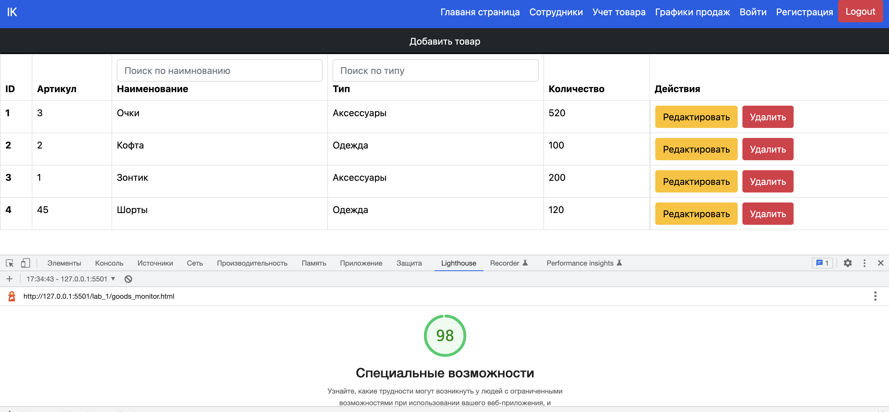
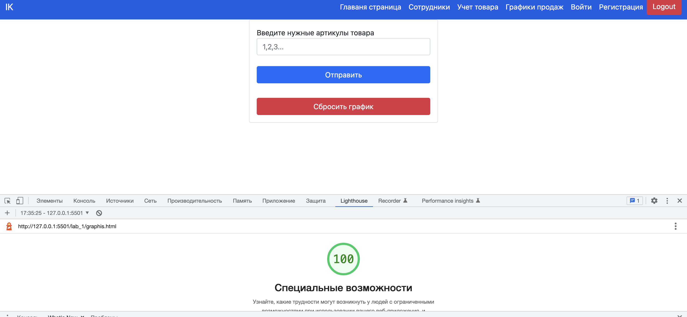
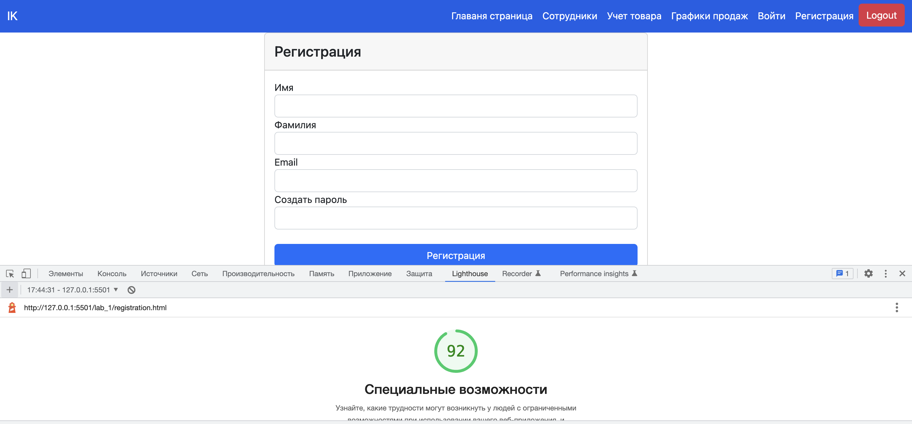

# Практическая работа № 2 

`Описание:` Задание: улучшить доступность ранее реализованного сайта. Добавить необходимые HTML-атрибуты ко всему контенту на странице и проверить это с помощью инструментов из Dev Tools браузера Firefox и сервиса Google Lighthouse.

> Тест 1

> Тест 2

> Тест 3

> Тест 4

# Вывод 

Первичные тесты показали балл > 90, поэтому код не менял. 
Получается, изначально при верстке сайта использовал правильные принципы доступности