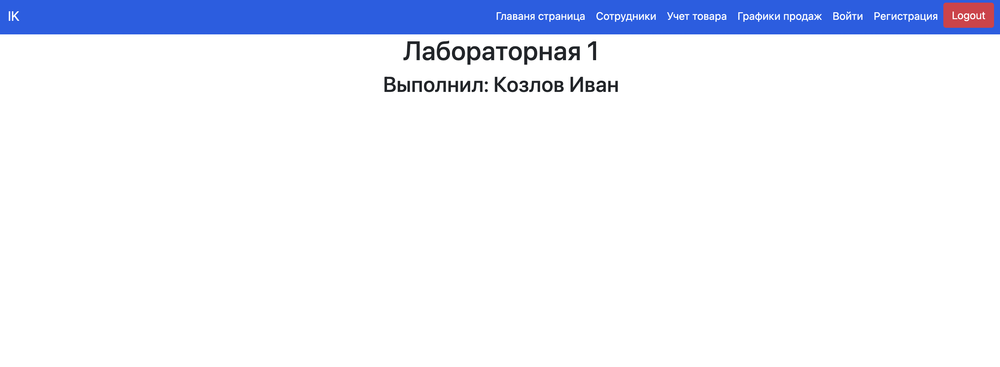
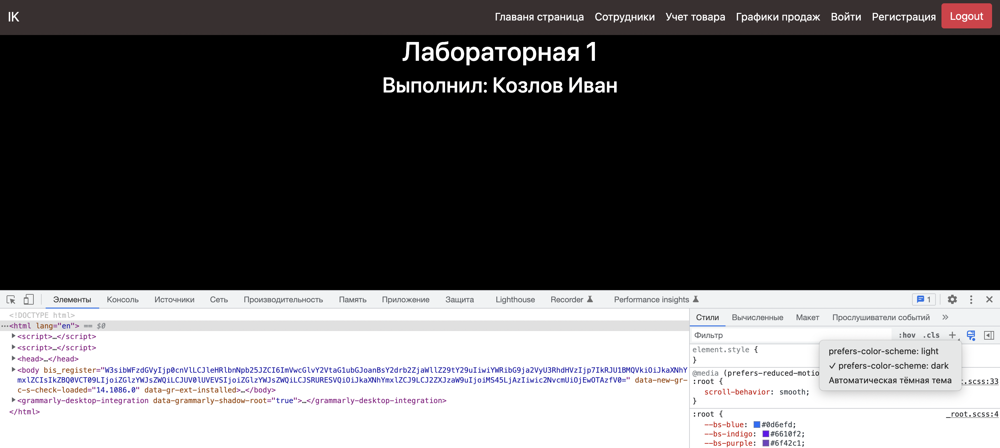
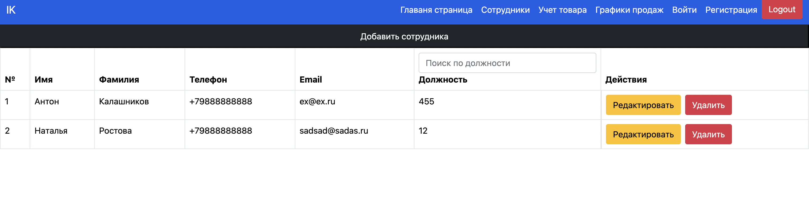
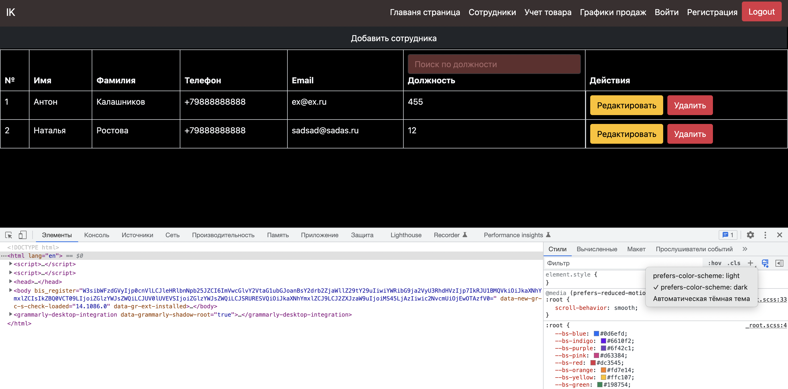
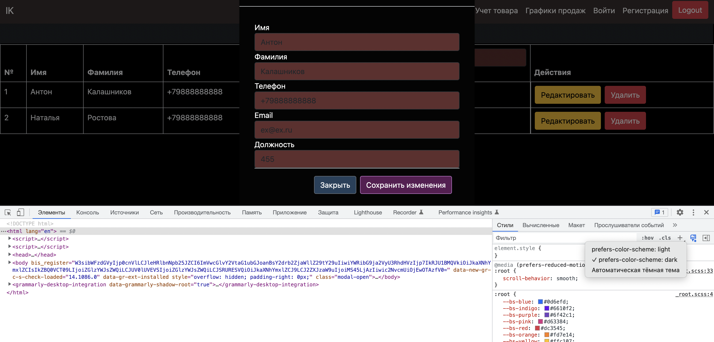
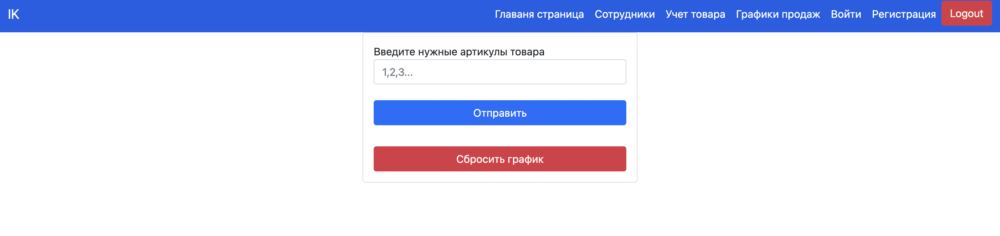
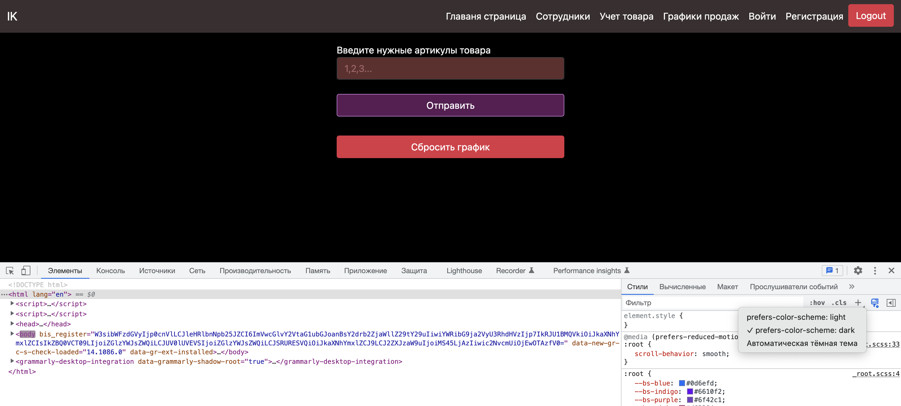

# Практическая работа № 3

`Описание:` выполнить темизацию ранее реализованного сайта

> До

> после

> До

> после

> До

> после

> До

> после

# Вывод

Научился применять темизацию для сайта, средстави CSS, за счет перегрузки стилей по умолчанию на новые.