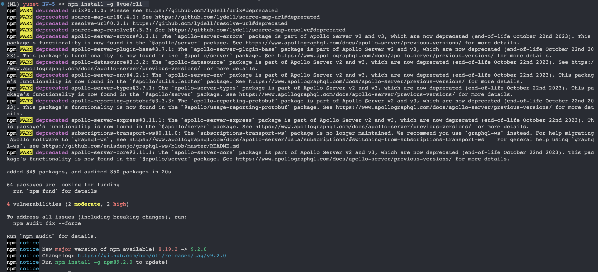
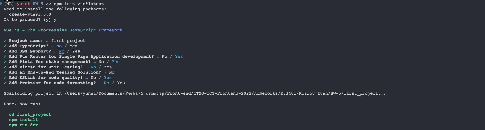
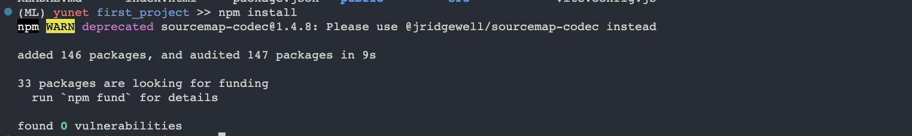

# Практическая работа № 5

`Описание:` В рамках данной работы Вам предстоит изучить основные команды пакетного менеджера NPM и научиться стартовать проект на Vue.

<hr>

## 1. Установка vue

> `>> npm install -g @vue/cli`



<hr>

## 2. Инициализация проекта

> `>> npm init vue@latest`




<hr>

## 3. Установим зависимости

> `>> cd first_project` 

> `>> npm install`



- В файле package.json надо сделать следующие изменения в секции scripts:

```json
{
  "name": "first_project",
  "version": "0.0.0",
  "private": true,
  "scripts": {
    "start": "vite --port 9000",
    "dev": "vite",
    "build": "vite build",
    "preview": "vite preview",
    "lint": "eslint . --ext .vue,.js,.jsx,.cjs,.mjs --fix --ignore-path .gitignore"
    },
  "dependencies": {
    "pinia": "^2.0.28",
    "vue": "^3.2.45",
    "vue-router": "^4.1.6"
  },
  "devDependencies": {
    "@vitejs/plugin-vue": "^4.0.0",
    "eslint": "^8.22.0",
    "eslint-plugin-vue": "^9.3.0",
    "vite": "^4.0.0"
  }
}
```

<hr>

## 4. Запускаем проект

> `>> npm start`


<hr>

## Вывод

В ходе работы я научился запускать vue проект, с помощью npm