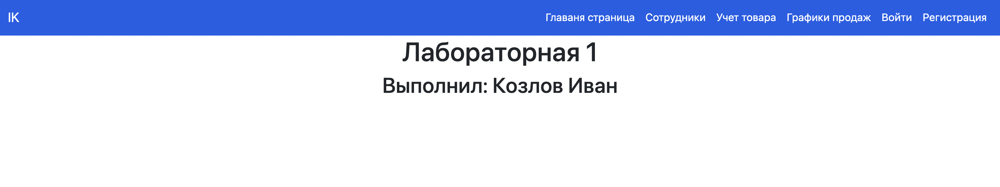
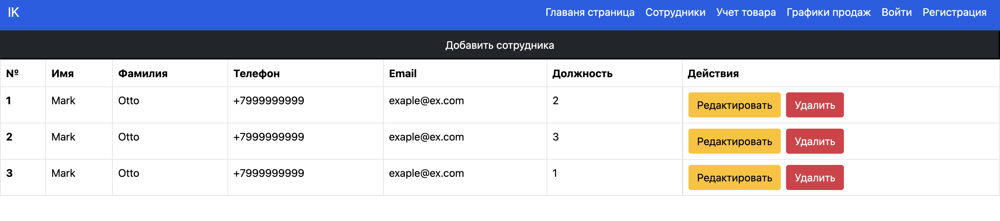
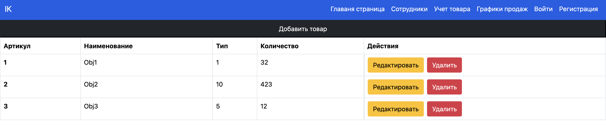
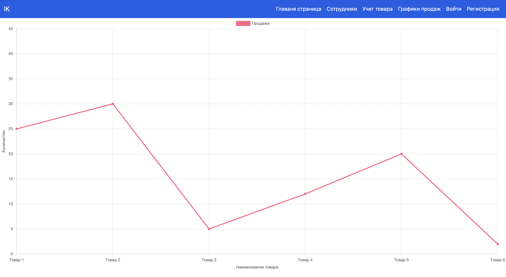
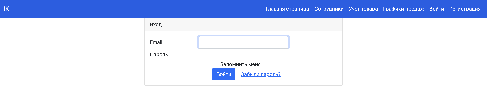
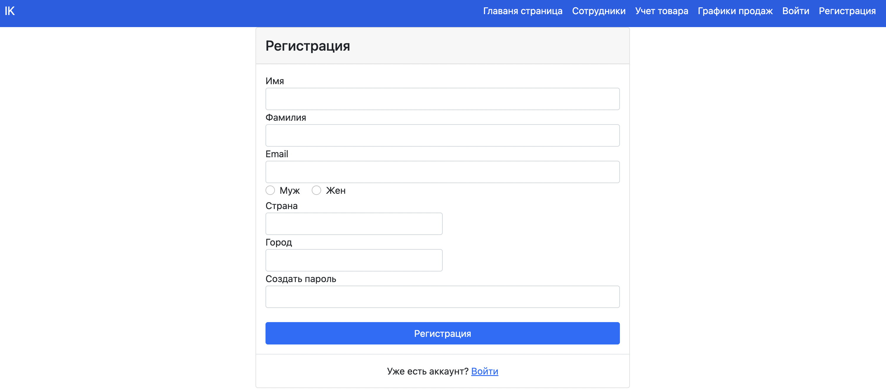

# Лабораторная работа № 1 
<h2> Вёрстка сайта средствами HTML, CSS и Bootstrap </h2>
`Описание:`
В рамках данной лабораторной работы Вам предложено выбрать один из нескольких вариантов. Выбранный вариант останется единым на весь курс и будет использоваться в последующих лабораторных работах.

По выбранному варианту необходимо будет выполнить вёрстку сайта средствами HTML, CSS и Bootstrap. Продумать и реализовать моменты, в которых необходим JS (например, открытие модальных окон).

`Вариант:` сайт администратора интернет-магазина 

Необходимо реализовать:

- Вход

- Регистрация

- Учёт товара на складе

- Графики по продажам тех или иных товаров, по общей выручке предприятия

- Управление сотрудниками

<hr>

# Главная страница

* `index.html` - главная страница с титульником

> **Скриншот**



> **Код**

```html 
<!DOCTYPE html>
<html lang="en">

<head>
    <meta charset="utf-8">
    <meta name="viewport" content="width=device-width, initial-scale=1">
    <title> Войти </title>
    <link href="https://cdn.jsdelivr.net/npm/bootstrap@5.0.2/dist/css/bootstrap.min.css" rel="stylesheet"
        integrity="sha384-EVSTQN3/azprG1Anm3QDgpJLIm9Nao0Yz1ztcQTwFspd3yD65VohhpuuCOmLASjC" 
        crossorigin="anonymous">
    <script src="https://cdn.jsdelivr.net/npm/bootstrap@5.0.2/dist/js/bootstrap.bundle.min.js"
        integrity="sha384-MrcW6ZMFYlzcLA8Nl+NtUVF0sA7MsXsP1UyJoMp4YLEuNSfAP+JcXn/tWtIaxVXM"
        crossorigin="anonymous"></script>
</head>

<body>
    <nav class="navbar navbar-expand-md navbar-light sidebarNavigation color-me "
        data-sidebarClass="navbar-dark bg-dark" style="background-color: #145ee7;">
        <div class="container-fluid">
            <a class="navbar-brand" href="index.html" style="color: #ffffff;">IK</a>
            <button class="navbar-toggler" type="button" data-bs-toggle="collapse" 
            data-bs-target="#navbarCollapse"
                aria-controls="navbarCollapse" aria-expanded="false" aria-label="Toggle navigation">
                <span class="navbar-toggler-icon"></span>
            </button>

            <div class="collapse navbar-collapse" id="navbarCollapse">
                <ul class="nav navbar-nav nav-flex-icons ms-auto">
                    <li class="nav-item">
                        <a class="nav-link" href="index.html" style="color: #ffffff;"> Главаня страница
                        </a>
                    </li>
                    <li class="nav-item">
                        <a class="nav-link" href="workers.html" style="color: #ffffff;">Сотрудники</a>
                    </li>
                    <li class="nav-item">
                        <a class="nav-link" href="goods_monitor.html" style="color: #ffffff;">
                        Учет товара
                        </a>
                    </li>
                    <li class="nav-item">
                        <a class="nav-link" href="graphis.html" style="color: #ffffff;">
                        Графики продаж
                        </a>
                    </li>
                    <li class="nav-item">
                        <a class="nav-link" href="login.html" style="color: #ffffff;">Войти</a>
                    </li>
                    <li class="nav-item">
                        <a class="nav-link" href="registration.html" style="color: #ffffff;">
                        Регистрация
                        </a>
                    </li>
                </ul>
            </div>
        </div>
    </nav>
    <main>
        <h1 class="d-flex justify-content-center">
            Лабораторная 1
        </h1>
        <h2 class="d-flex justify-content-center">
            Выполнил: Козлов Иван
        </h2>
    </main>
</body>

</html>
```

<hr>

# Сотрудники

* `workers.html` - страница с таблицей сотрудников, которую можно редактировать

> **Скриншот**
  


> **Код**

```html
<!DOCTYPE html>
<html lang="en">

<head>
    <meta charset="utf-8">
    <meta name="viewport" content="width=device-width, initial-scale=1">
    <title> Войти </title>
    <link href="https://cdn.jsdelivr.net/npm/bootstrap@5.0.2/dist/css/bootstrap.min.css" rel="stylesheet"
        integrity="sha384-EVSTQN3/azprG1Anm3QDgpJLIm9Nao0Yz1ztcQTwFspd3yD65VohhpuuCOmLASjC" crossorigin="anonymous">
    <script src="https://cdn.jsdelivr.net/npm/bootstrap@5.0.2/dist/js/bootstrap.bundle.min.js"
        integrity="sha384-MrcW6ZMFYlzcLA8Nl+NtUVF0sA7MsXsP1UyJoMp4YLEuNSfAP+JcXn/tWtIaxVXM"
        crossorigin="anonymous"></script>
</head>

<body>
    <nav class="navbar navbar-expand-md navbar-light sidebarNavigation color-me "
        data-sidebarClass="navbar-dark bg-dark" style="background-color: #145ee7;">
        <div class="container-fluid">
            <a class="navbar-brand" href="index.html" style="color: #ffffff;">IK</a>
            <button class="navbar-toggler" type="button" data-bs-toggle="collapse" 
            data-bs-target="#navbarCollapse"
                aria-controls="navbarCollapse" aria-expanded="false" aria-label="Toggle navigation">
                <span class="navbar-toggler-icon"></span>
            </button>

            <div class="collapse navbar-collapse" id="navbarCollapse">
                <ul class="nav navbar-nav nav-flex-icons ms-auto">
                    <li class="nav-item">
                        <a class="nav-link" href="index.html" style="color: #ffffff;"> Главаня страница
                        </a>
                    </li>
                    <li class="nav-item">
                        <a class="nav-link" href="workers.html" style="color: #ffffff;">Сотрудники</a>
                    </li>
                    <li class="nav-item">
                        <a class="nav-link" href="goods_monitor.html" style="color: #ffffff;">
                        Учет товара
                        </a>
                    </li>
                    <li class="nav-item">
                        <a class="nav-link" href="graphis.html" style="color: #ffffff;">
                        Графики продаж
                        </a>
                    </li>
                    <li class="nav-item">
                        <a class="nav-link" href="login.html" style="color: #ffffff;">Войти</a>
                    </li>
                    <li class="nav-item">
                        <a class="nav-link" href="registration.html" style="color: #ffffff;">
                        Регистрация
                        </a>
                    </li>
                </ul>
            </div>
        </div>
    </nav>

    <div class="d-flex justify-content-end ">
        <button type="button" class="btn-dark p-2 flex-grow-1">Добавить сотрудника</button>
    </div>

    <div class="table-responsive">

        <table class="table table-hover table-bordered" style="color: rgb(0, 0, 0)">
            <thead>
                <tr>
                    <th scope="col">№</th>
                    <th scope="col">Имя</th>
                    <th scope="col">Фамилия</th>
                    <th scope="col">Телефон</th>
                    <th scope="col">Email</th>
                    <th scope="col">Должность</th>
                    <th scope="col">Действия</th>
                </tr>
            </thead>
            <tbody>
                <tr>
                    <th scope="row">1</th>
                    <td>Mark</td>
                    <td>Otto</td>
                    <td>+7999999999</td>
                    <td>exaple@ex.com</td>
                    <td>2</td>
                    <td class="d-flex justify-content-start gap-2">
                        <button type="button" class="btn btn-warning">Редактировать</button>
                        <button type="button" class="btn btn-danger">Удалить</button>
                    </td>
                </tr>
                <tr>
                    <th scope="row">2</th>
                    <td>Mark</td>
                    <td>Otto</td>
                    <td>+7999999999</td>
                    <td>exaple@ex.com</td>
                    <td>3</td>
                    <td class="d-flex justify-content-start gap-2">
                        <button type="button" class="btn btn-warning">Редактировать</button>
                        <button type="button" class="btn btn-danger">Удалить</button>
                    </td>
                </tr>
                <tr>
                    <th scope="row">3</th>
                    <td>Mark</td>
                    <td>Otto</td>
                    <td>+7999999999</td>
                    <td>exaple@ex.com</td>
                    <td>1</td>
                    <td class="d-flex justify-content-start gap-2">
                        <button type="button" class="btn btn-warning">Редактировать</button>
                        <button type="button" class="btn btn-danger">Удалить</button>
                    </td>
                </tr>
            </tbody>
        </table>
    </div>
</body>

</html>
```

<hr>

# Учет товара

* `goods_monitor.html` - страница с таблицей товаров, которую можно редактировать

> **Скриншот**



> **Код**

```html
<!DOCTYPE html>
<html lang="en">

<head>
    <meta charset="utf-8">
    <meta name="viewport" content="width=device-width, initial-scale=1">
    <title> Войти </title>
    <link href="https://cdn.jsdelivr.net/npm/bootstrap@5.0.2/dist/css/bootstrap.min.css" rel="stylesheet"
        integrity="sha384-EVSTQN3/azprG1Anm3QDgpJLIm9Nao0Yz1ztcQTwFspd3yD65VohhpuuCOmLASjC" crossorigin="anonymous">
    <script src="https://cdn.jsdelivr.net/npm/bootstrap@5.0.2/dist/js/bootstrap.bundle.min.js"
        integrity="sha384-MrcW6ZMFYlzcLA8Nl+NtUVF0sA7MsXsP1UyJoMp4YLEuNSfAP+JcXn/tWtIaxVXM"
        crossorigin="anonymous"></script>
</head>

<body>
    <nav class="navbar navbar-expand-md navbar-light sidebarNavigation color-me "
        data-sidebarClass="navbar-dark bg-dark" style="background-color: #145ee7;">
        <div class="container-fluid">
            <a class="navbar-brand" href="index.html" style="color: #ffffff;">IK</a>
            <button class="navbar-toggler" type="button" data-bs-toggle="collapse" 
            data-bs-target="#navbarCollapse"
                aria-controls="navbarCollapse" aria-expanded="false" aria-label="Toggle navigation">
                <span class="navbar-toggler-icon"></span>
            </button>

            <div class="collapse navbar-collapse" id="navbarCollapse">
                <ul class="nav navbar-nav nav-flex-icons ms-auto">
                    <li class="nav-item">
                        <a class="nav-link" href="index.html" style="color: #ffffff;"> Главаня страница
                        </a>
                    </li>
                    <li class="nav-item">
                        <a class="nav-link" href="workers.html" style="color: #ffffff;">
                        Сотрудники
                        </a>
                    </li>
                    <li class="nav-item">
                        <a class="nav-link" href="goods_monitor.html" style="color: #ffffff;">
                        Учет товара
                        </a>
                    </li>
                    <li class="nav-item">
                        <a class="nav-link" href="graphis.html" style="color: #ffffff;">
                        Графики продаж
                        /a>
                    </li>
                    <li class="nav-item">
                        <a class="nav-link" href="login.html" style="color: #ffffff;">Войти</a>
                    </li>
                    <li class="nav-item">
                        <a class="nav-link" href="registration.html" style="color: #ffffff;">
                        Регистрация
                        </a>
                    </li>
                </ul>
            </div>
        </div>
    </nav>

    <div class="d-flex justify-content-end ">
        <button type="button" class="btn-dark p-2 flex-grow-1">Добавить товар</button>
    </div>

    <div class="table-responsive">
        <table class="table table-hover table-bordered " style="color: rgb(0, 0, 0)">
            <thead>
                <tr>
                    <th scope="col">Артикул</th>
                    <th scope="col">Наименование</th>
                    <th scope="col">Тип</th>
                    <th scope="col">Количество</th>
                    <th scope="col">Действия</th>
                </tr>
            </thead>
            <tbody>
                <tr>
                    <th scope="row">1</th>
                    <td>Obj1</td>
                    <td>1</td>
                    <td>32</td>
                    <td class="d-flex justify-content-start gap-2">
                        <button type="button" class="btn btn-warning">Редактировать</button>
                        <button type="button" class="btn btn-danger">Удалить</button>
                    </td>
                </tr>
                <tr>
                    <th scope="row">2</th>
                    <td>Obj2</td>
                    <td>10</td>
                    <td>423</td>
                    <td class="d-flex justify-content-start gap-2">
                        <button type="button" class="btn btn-warning">Редактировать</button>
                        <button type="button" class="btn btn-danger">Удалить</button>
                    </td>
                </tr>
                <tr>
                    <th scope="row">3</th>
                    <td>Obj3</td>
                    <td>5</td>
                    <td>12</td>
                    <td class="d-flex justify-content-start gap-2">
                        <button type="button" class="btn btn-warning">Редактировать</button>
                        <button type="button" class="btn btn-danger">Удалить</button>
                    </td>
                </tr>
            </tbody>
        </table>
    </div>


</body>

</html>
```

<hr>

# Графики продаж

* `graphis.html` - страница с графиком, где ось `y` - колчество проданного товара, ось `x` - наименоваие товара 

> **Скриншот**



> **Код**

```html
<!DOCTYPE html>
<html lang="en">

<head>
    <meta charset="utf-8">
    <meta name="viewport" content="width=device-width, initial-scale=1">
    <title> Войти </title>
    <link href="https://cdn.jsdelivr.net/npm/bootstrap@5.0.2/dist/css/bootstrap.min.css" rel="stylesheet"
        integrity="sha384-EVSTQN3/azprG1Anm3QDgpJLIm9Nao0Yz1ztcQTwFspd3yD65VohhpuuCOmLASjC" 
        crossorigin="anonymous">
    <script src="https://cdn.jsdelivr.net/npm/bootstrap@5.0.2/dist/js/bootstrap.bundle.min.js"
        integrity="sha384-MrcW6ZMFYlzcLA8Nl+NtUVF0sA7MsXsP1UyJoMp4YLEuNSfAP+JcXn/tWtIaxVXM"
        crossorigin="anonymous"></script>
    <script src="https://cdnjs.cloudflare.com/ajax/libs/Chart.js/3.9.1/chart.min.js"></script>

</head>

<body>
    <nav class="navbar navbar-expand-md navbar-light sidebarNavigation color-me "
        data-sidebarClass="navbar-dark bg-dark" style="background-color: #145ee7;">
        <div class="container-fluid">
            <a class="navbar-brand" href="index.html" style="color: #ffffff;">IK</a>
            <button class="navbar-toggler" type="button" data-bs-toggle="collapse" data-bs-target="#navbarCollapse"
                aria-controls="navbarCollapse" aria-expanded="false" aria-label="Toggle navigation">
                <span class="navbar-toggler-icon"></span>
            </button>

            <div class="collapse navbar-collapse" id="navbarCollapse">
                <ul class="nav navbar-nav nav-flex-icons ms-auto">
                    <li class="nav-item">
                        <a class="nav-link" href="index.html" style="color: #ffffff;"> Главаня страница
                        </a>
                    </li>
                    <li class="nav-item">
                        <a class="nav-link" href="workers.html" style="color: #ffffff;">Сотрудники</a>
                    </li>
                    <li class="nav-item">
                        <a class="nav-link" href="goods_monitor.html" style="color: #ffffff;">
                        Учет товара
                        </a>
                    </li>
                    <li class="nav-item">
                        <a class="nav-link" href="graphis.html" style="color: #ffffff;">
                        Графики продаж
                        </a>
                    </li>
                    <li class="nav-item">
                        <a class="nav-link" href="login.html" style="color: #ffffff;">Войти</a>
                    </li>
                    <li class="nav-item">
                        <a class="nav-link" href="registration.html" style="color: #ffffff;">
                        Регистраци
                        </a>
                    </li>
                </ul>
            </div>
        </div>
    </nav>

    <div>
        <canvas id="myChart"></canvas>
        <script>
            const labels = [
                'Товар 1',
                'Товар 2',
                'Товар 3',
                'Товар 4',
                'Товар 5',
                'Товар 6',
            ];

            const data = {
                labels: labels,
                datasets: [{
                    label: 'Продажи',
                    backgroundColor: 'rgb(255, 99, 132)',
                    borderColor: 'rgb(255, 99, 132)',
                    data: [25, 30, 5, 12, 20, 2, 45],
                }]
            };

            const config = {
                type: 'line',
                data: data,
                options: {
                    scales: {
                        y: {
                            title: {
                                display: true,
                                text: 'Количество'
                            }
                        },
                        x: {
                            title: {
                                display: true,
                                text: 'Наименования товара'
                            }
                        }
                    }
                }
            };

        </script>
        <script>
            const myChart = new Chart(
                document.getElementById('myChart'),
                config
            );
        </script>


    </div>


</body>

</html>
```

<hr>

# Войти

* `login.html` - страница входа 

> **Скриншот**



> **Код**

```html
<!DOCTYPE html>
<html lang="en">

<head>
    <meta charset="utf-8">
    <meta name="viewport" content="width=device-width, initial-scale=1">
    <title> Войти </title>
    <link href="https://cdn.jsdelivr.net/npm/bootstrap@5.0.2/dist/css/bootstrap.min.css" rel="stylesheet"
        integrity="sha384-EVSTQN3/azprG1Anm3QDgpJLIm9Nao0Yz1ztcQTwFspd3yD65VohhpuuCOmLASjC" crossorigin="anonymous">
    <script src="https://cdn.jsdelivr.net/npm/bootstrap@5.0.2/dist/js/bootstrap.bundle.min.js"
        integrity="sha384-MrcW6ZMFYlzcLA8Nl+NtUVF0sA7MsXsP1UyJoMp4YLEuNSfAP+JcXn/tWtIaxVXM"
        crossorigin="anonymous"></script>
</head>

<body>
    <nav class="navbar navbar-expand-md navbar-light sidebarNavigation color-me "
        data-sidebarClass="navbar-dark bg-dark" style="background-color: #145ee7;">
        <div class="container-fluid">
            <a class="navbar-brand" href="index.html" style="color: #ffffff;">IK</a>
            <button class="navbar-toggler" type="button" data-bs-toggle="collapse" 
            data-bs-target="#navbarCollapse"
                aria-controls="navbarCollapse" aria-expanded="false" aria-label="Toggle navigation">
                <span class="navbar-toggler-icon"></span>
            </button>

            <div class="collapse navbar-collapse" id="navbarCollapse">
                <ul class="nav navbar-nav nav-flex-icons ms-auto">
                    <li class="nav-item">
                        <a class="nav-link" href="index.html" style="color: #ffffff;"> Главаня страница
                        </a>
                    </li>
                    <li class="nav-item">
                        <a class="nav-link" href="workers.html" style="color: #ffffff;">Сотрудники</a>
                    </li>
                    <li class="nav-item">
                        <a class="nav-link" href="goods_monitor.html" style="color: #ffffff;">
                        Учет товара
                        </a>
                    </li>
                    <li class="nav-item">
                        <a class="nav-link" href="graphis.html" style="color: #ffffff;">
                        Графики продаж
                        </a>
                    </li>
                    <li class="nav-item">
                        <a class="nav-link" href="login.html" style="color: #ffffff;">Войти</a>
                    </li>
                    <li class="nav-item">
                        <a class="nav-link" href="registration.html" style="color: #ffffff;">
                        Регистрация
                        </a>
                    </li>
                </ul>
            </div>
        </div>
    </nav>

    <main class="login-form">
        <div class="cotainer">
            <div class="row justify-content-center">
                <div class="col-md-5">
                    <div class="card">
                        <div class="card-header">Вход</div>
                        <div class="card-body">
                            <form action="" method="">
                                <div class="form-group row">
                                    <label for="email_address" 
                                    class="col-md-3 col-form-label text-md-right">Email
                                    </label>
                                    <div class="col-md-6">
                                        <input type="text" id="email_address" 
                                        class="form-control" name="email-address"
                                            required autofocus>
                                    </div>
                                </div>

                                <div class="form-group row">
                                    <label for="password" 
                                    class="col-md-3 col-form-label text-md-right">Пароль</label>
                                    <div class="col-md-6">
                                        <input type="password" id="password" 
                                        class="form-control" name="password"
                                            required>
                                    </div>
                                </div>

                                <div class="form-group row">
                                    <div class="col-md-6 offset-md-4">
                                        <div class="checkbox">
                                            <label>
                                                <input type="checkbox" name="remember"> Запомнить меня
                                            </label>
                                        </div>
                                    </div>
                                </div>

                                <div class="col-md-6 offset-md-4">
                                    <button type="submit" class="btn btn-primary">
                                        Войти
                                    </button>
                                    <a href="#" class="btn btn-link">
                                        Забыли пароль?
                                    </a>
                                </div>
                        </div>
                        </form>
                    </div>
                </div>
            </div>
        </div>
        </div>

    </main>

</body>

</html>
```

<hr>

# Регистрация

* `registration.html` - страница регистрации 

> **Скриншот**



> **Код**

```html
<!DOCTYPE html>
<html lang="en">

<head>
    <!-- Кодировка веб-страницы -->
    <meta charset="utf-8">
    <!-- Настройка viewport -->
    <meta name="viewport" content="width=device-width, initial-scale=1">
    <title> Войти </title>
    <!-- Bootstrap CSS (jsDelivr CDN) -->
    <link href="https://cdn.jsdelivr.net/npm/bootstrap@5.0.2/dist/css/bootstrap.min.css" rel="stylesheet"
        integrity="sha384-EVSTQN3/azprG1Anm3QDgpJLIm9Nao0Yz1ztcQTwFspd3yD65VohhpuuCOmLASjC" crossorigin="anonymous">
    <script src="https://cdn.jsdelivr.net/npm/bootstrap@5.0.2/dist/js/bootstrap.bundle.min.js"
        integrity="sha384-MrcW6ZMFYlzcLA8Nl+NtUVF0sA7MsXsP1UyJoMp4YLEuNSfAP+JcXn/tWtIaxVXM"
        crossorigin="anonymous"></script>
    <link rel="stylesheet" href="https://use.fontawesome.com/releases/v5.0.8/css/all.css">
</head>

<body>
    <nav class="navbar navbar-expand-md navbar-light sidebarNavigation color-me "
        data-sidebarClass="navbar-dark bg-dark" style="background-color: #145ee7;">
        <div class="container-fluid">
            <a class="navbar-brand" href="index.html" style="color: #ffffff;">IK</a>
            <button class="navbar-toggler" type="button" data-bs-toggle="collapse"
             data-bs-target="#navbarCollapse"
                aria-controls="navbarCollapse" aria-expanded="false" aria-label="Toggle navigation">
                <span class="navbar-toggler-icon"></span>
            </button>

            <div class="collapse navbar-collapse" id="navbarCollapse">
                <ul class="nav navbar-nav nav-flex-icons ms-auto">
                    <li class="nav-item">
                        <a class="nav-link" href="index.html" style="color: #ffffff;"> Главаня страница
                        </a>
                    </li>
                    <li class="nav-item">
                        <a class="nav-link" href="workers.html" style="color: #ffffff;">Сотрудники</a>
                    </li>
                    <li class="nav-item">
                        <a class="nav-link" href="goods_monitor.html" style="color: #ffffff;">
                        Учет товара
                        </a>
                    </li>
                    <li class="nav-item">
                        <a class="nav-link" href="graphis.html" style="color: #ffffff;">
                        Графики продаж
                        </a>
                    </li>
                    <li class="nav-item">
                        <a class="nav-link" href="login.html" style="color: #ffffff;">Войти</a>
                    </li>
                    <li class="nav-item">
                        <a class="nav-link" href="registration.html" style="color: #ffffff;">
                        Регистрация
                        </a>
                    </li>
                </ul>
            </div>
        </div>
    </nav>

    <div class="container">
        <div class="row justify-content-center">
            <div class="col-md-6">
                <div class="card">
                    <header class="card-header">
                        <h4 class="card-title mt-2">Регистрация</h4>
                    </header>
                    <article class="card-body">
                        <form>
                            <div class="form-row">
                                <div class="col form-group">
                                    <label>Имя </label>
                                    <input type="text" class="form-control" placeholder="">
                                </div> <!-- form-group end.// -->
                                <div class="col form-group">
                                    <label>Фамилия </label>
                                    <input type="text" class="form-control" placeholder=" ">
                                </div> <!-- form-group end.// -->
                            </div> <!-- form-row end.// -->
                            <div class="form-group">
                                <label>Email </label>
                                <input type="email" class="form-control" placeholder="">
                            </div> <!-- form-group end.// -->
                            <div class="form-group">
                                <label class="form-check form-check-inline">
                                    <input class="form-check-input" type="radio" 
                                    name="gender" value="option1">
                                    <span class="form-check-label"> Муж </span>
                                </label>
                                <label class="form-check form-check-inline">
                                    <input class="form-check-input" type="radio"
                                    name="gender" value="option2">
                                    <span class="form-check-label"> Жен </span>
                                </label>
                            </div> <!-- form-group end.// -->
                            <div class="form-row">
                                <div class="form-group col-md-6">
                                    <label>Страна</label>
                                    <input type="text" class="form-control">
                                </div> <!-- form-group end.// -->
                                <div class="form-group col-md-6">
                                    <label>Город</label>
                                    <input type="text" class="form-control">
                                </div> <!-- form-group end.// -->
                            </div> <!-- form-row.// -->
                            <div class="form-group">
                                <label>Создать пароль</label>
                                <input class="form-control" type="password">
                            </div> <!-- form-group end.// -->
                            <div class="form-group d-flex flex-column justify-content-start">
                                <br>
                                <button type="submit" class="btn btn-primary"> Регистрация
                                </button>
                            </div> <!-- form-group// -->

                        </form>
                    </article> <!-- card-body end .// -->
                    <div class="border-top card-body text-center">Уже есть аккаунт? 
                        <a href="login.html">Войти</a>
                    </div>
                </div> <!-- card.// -->
            </div> <!-- col.//-->

        </div> <!-- row.//-->


    </div>


</body>

</html>
```

# Вывод
В ходе работы были сделаны верстки 6 страниц, добавлены две таблицы, один график, форма регистрации и входа с помощью  HTML, CSS и Bootstrap.