# Домашние работы

## Домашняя работа 1: CSS Flexbox, CSS Grid

Задание: пройти игры Flexbox Froggy и Grid Garden

* Flexbox Froggy

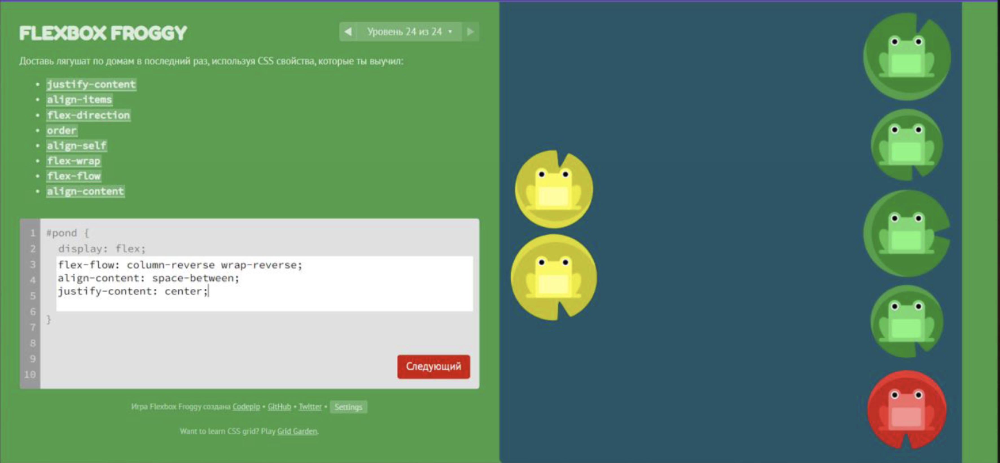

* Grid Garden

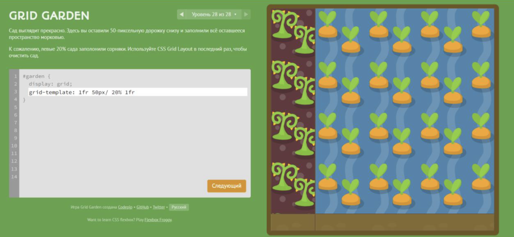

## Домашняя работа 2: доступность в HTML

Задание: улучшить доступность ранее реализованного сайта. Добавить необходимые HTML-атрибуты ко всему контенту на странице и проверить это с помощью инструментов из Dev Tools браузера Firefox и сервиса Google Lighthouse.

До рефакторинга графы были около 85%, а после рефакторинга почти все поднялись до 95-100%.

* Изменен фомат картинок, их расширение, размер, добавлены высота и ширина
* Добавлены alt описания картинок
* Добавлены meta описания в начале страниц
* Размеры шрифтов отккоректированы согласно h1, h2, h3, h4, h5
* Для каждой ссылки добавлен href и aria-label
* Добавлено описание к кнопкам

После рефакторинга:

* main.html


* phototrip.html


* lk.html

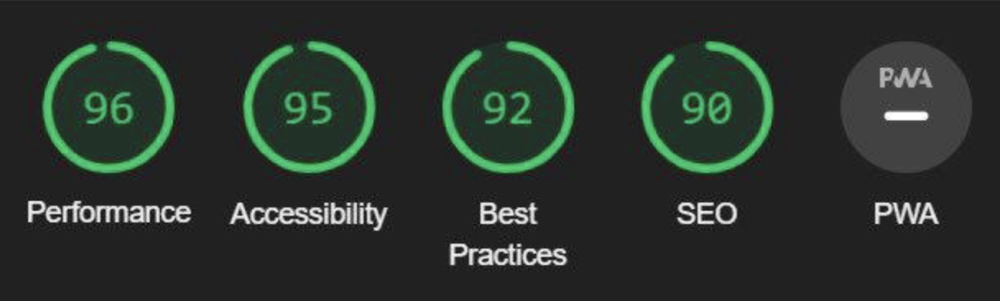

* calendar.html


Ошибку с кешированием сайта в Best Practices исправить не удалось

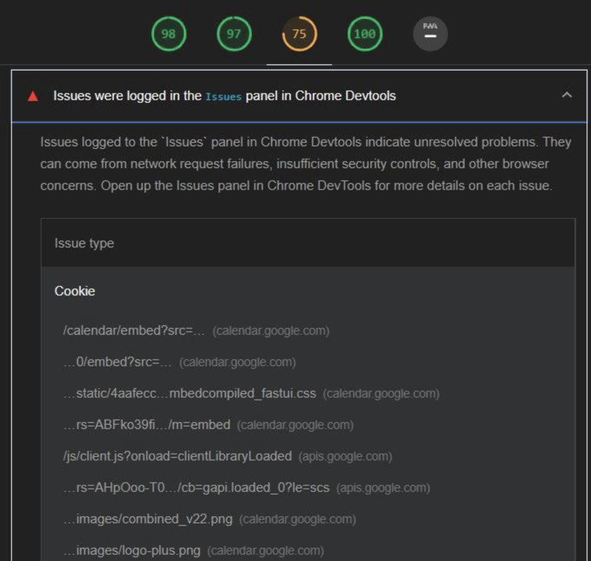

* entrance.html

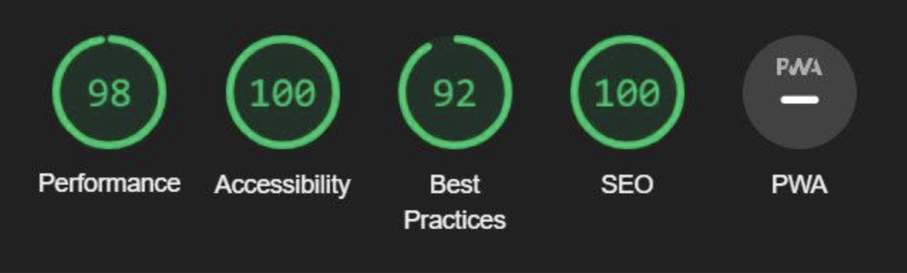

* registration.html

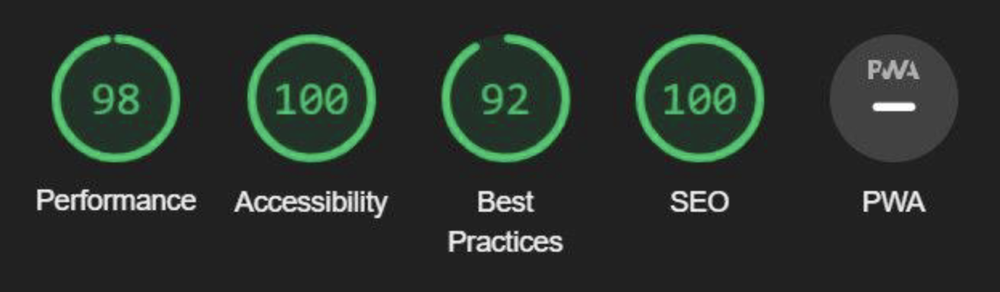

## Домашняя работа 3: CSS-переменные, темизация сайта средствами CSS

Задание: выполнить темизацию ранее реализованного сайта.

* `light.css`

* Реализован файл light.css

```css
:root {
	--nav-color: #1A1A1D;
	--color-text: #fff;
	--color-text-h1: #1A1A1D;
	--bac-color: #fff;
	--button-color: #950740;
	--color-text-btn: #fff;
}
```

* `dark.css`

* Реализован файл dark.css

```css
:root {
	--nav-color: #1A1A1D;
	--color-text: #fff;
	--color-text-h1: #fff;
	--bac-color: #1A1A1D;
	--button-color: #fff;
	--color-text-btn: #1A1A1D;
}
```

* Главная страница в светлой теме

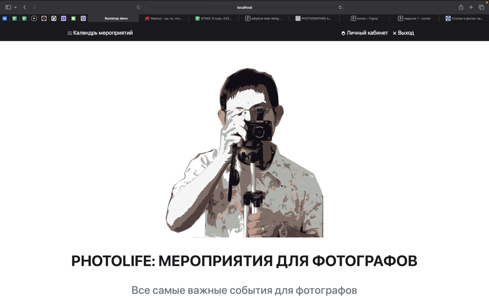

* Главная страница в темной теме


* Личный кабинет в светлой теме

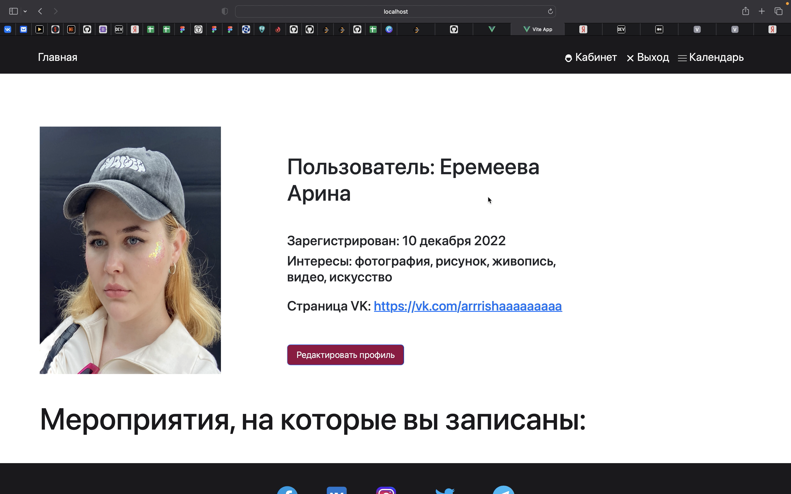

* Личный кабинет в темной теме

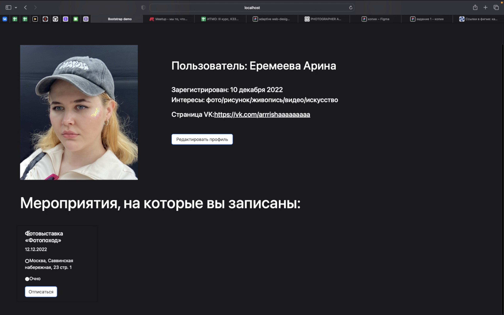

* Страница описания мероприятия в светлой теме

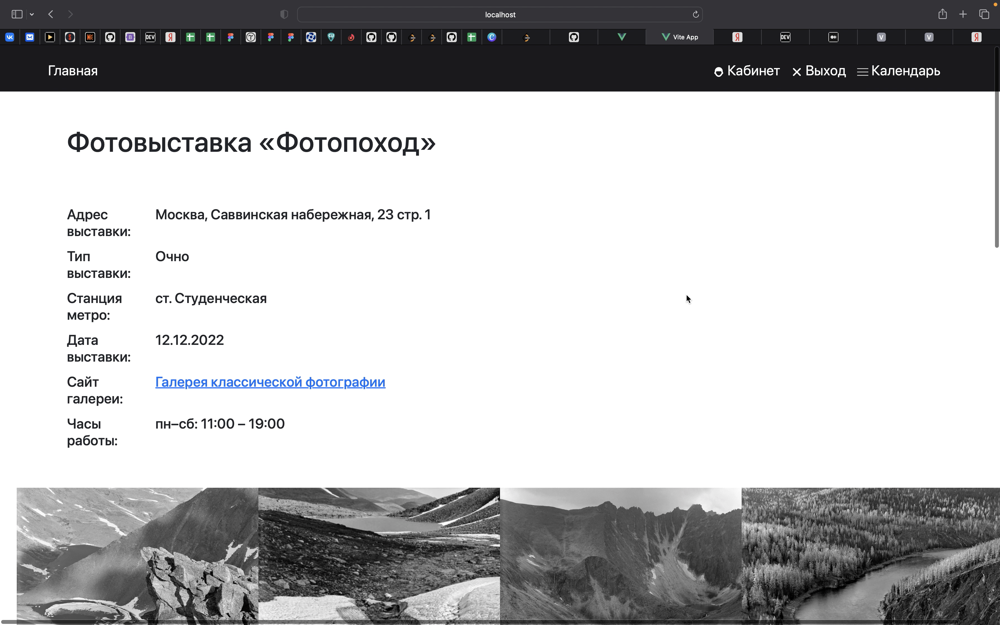

* Страница описания мероприятия в темной теме


## Домашняя работа 4: SVG-спрайт

Задание: вынести все используемые ранее SVG-иконки в общий SVG-спрайт.

* код иконок svg

```html 
<svg xmlns="http://www.w3.org/2000/svg" xmlns:xlink="http://www.w3.org/1999/xlink" display="none">

	//иконка календарь
	<symbol id="calendar" xmlns="http://www.w3.org/2000/svg" x="0px" y="0px" width="50" height="50" fill="currentColor" viewBox="0 0 50 50">
		<path fill-rule="evenodd" d="M 0 9 L 0 11 L 50 11 L 50 9 Z M 0 24 L 0 26 L 50 26 L 50 24 Z M 0 39 L 0 41 L 50 41 L 50 39 Z"/>
	</symbol>

	//иконка вход
	<symbol id="ent" xmlns="http://www.w3.org/2000/svg" x="0px" y="0px"
	width="24" height="24"
	fill="currentColor"
	viewBox="0 0 24 24">
		<path fill-rule="evenodd" d="M 12 1 C 8.6761905 1 6 3.6761905 6 7 L 6 8 C 4.9 8 4 8.9 4 10 L 4 20 C 4 21.1 4.9 22 6 22 L 18 22 C 19.1 22 20 21.1 20 20 L 20 10 C 20 8.9 19.1 8 18 8 L 18 7 C 18 3.6761905 15.32381 1 12 1 z M 12 3 C 14.27619 3 16 4.7238095 16 7 L 16 8 L 8 8 L 8 7 C 8 4.7238095 9.7238095 3 12 3 z M 12 13 C 13.1 13 14 13.9 14 15 C 14 16.1 13.1 17 12 17 C 10.9 17 10 16.1 10 15 C 10 13.9 10.9 13 12 13 z"/>
	</symbol>
		
	//иконка выход
	<symbol id="exit" xmlns="http://www.w3.org/2000/svg" x="0px" y="0px"
	width="24" height="24"
	fill="currentColor"
	viewBox="0 0 24 24">
		<path fill-rule="evenodd" d="M 4.9902344 3.9902344 A 1.0001 1.0001 0 0 0 4.2929688 5.7070312 L 10.585938 12 L 4.2929688 18.292969 A 1.0001 1.0001 0 1 0 5.7070312 19.707031 L 12 13.414062 L 18.292969 19.707031 A 1.0001 1.0001 0 1 0 19.707031 18.292969 L 13.414062 12 L 19.707031 5.7070312 A 1.0001 1.0001 0 0 0 18.980469 3.9902344 A 1.0001 1.0001 0 0 0 18.292969 4.2929688 L 12 10.585938 L 5.7070312 4.2929688 A 1.0001 1.0001 0 0 0 4.9902344 3.9902344 z"/>
	</symbol>

	//личный кабинет
	<symbol id="lk" xmlns="http://www.w3.org/2000/svg" x="0px" y="0px" width="24" height="24" fill="currentColor" viewBox="0 0 24 24">
		<path d="M 12 2 C 7.582 2 4 5.582 4 10 L 4 11 L 4 11.902344 C 3.426291 12.449411 3 13.153146 3 14 C 3 15.241968 3.8575508 16.162904 4.9433594 16.613281 C 6.2443933 19.723094 8.8502365 22 12 22 C 15.149764 22 17.755607 19.723094 19.056641 16.613281 C 20.142449 16.162904 21 15.241968 21 14 C 21 13.153146 20.573709 12.449411 20 11.902344 L 20 11 L 20 10 C 20 5.582 16.418 2 12 2 z M 7 10 L 17 10 C 17.552 10 18 10.448 18 11 L 18 12 L 18 12.271484 A 1.0001 1.0001 0 0 0 18.501953 13.138672 C 18.805591 13.312973 19 13.615008 19 14 C 19 14.515121 18.631169 14.912712 18.138672 14.980469 A 1.0001 1.0001 0 0 0 17.339844 15.613281 C 16.309043 18.299502 14.258448 20 12 20 C 9.7415517 20 7.6909574 18.299502 6.6601562 15.613281 A 1.0001 1.0001 0 0 0 5.8613281 14.980469 C 5.3688308 14.912712 5 14.515121 5 14 C 5 13.615008 5.1944088 13.312973 5.4980469 13.138672 A 1.0001 1.0001 0 0 0 6 12.271484 L 6 12 L 6 11 C 6 10.448 6.448 10 7 10 z"/>
	</symbol>
			
	//иконка адрес
	<symbol id="addr" xmlns="http://www.w3.org/2000/svg" x="0px" y="0px" width="24" height="24" viewBox="0 0 24 24" fill="currentColor" class="bi bi-geo-alt-fill" viewBox="0 0 48 48">
		<path d="M 12 2 C 6.4889971 2 2 6.4889971 2 12 C 2 17.511003 6.4889971 22 12 22 C 17.511003 22 22 17.511003 22 12 C 22 6.4889971 17.511003 2 12 2 z M 12 4 C 16.430123 4 20 7.5698774 20 12 C 20 16.430123 16.430123 20 12 20 C 7.5698774 20 4 16.430123 4 12 C 4 7.5698774 7.5698774 4 12 4 z"/>
	</symbol>

	//иконка тип мероприятия
	<symbol id="type" xmlns="http://www.w3.org/2000/svg" width="16" height="16" fill="currentColor" class="bi bi-train-front" viewBox="0 0 24 24">
		<path d="M12,2C6.477,2,2,6.477,2,12s4.477,10,10,10s10-4.477,10-10S17.523,2,12,2z M12,17L12,17c-0.552,0-1-0.448-1-1v-4 c0-0.552,0.448-1,1-1h0c0.552,0,1,0.448,1,1v4C13,16.552,12.552,17,12,17z M12.5,9h-1C11.224,9,11,8.776,11,8.5v-1 C11,7.224,11.224,7,11.5,7h1C12.776,7,13,7.224,13,7.5v1C13,8.776,12.776,9,12.5,9z"/>
	</symbol>

	//записаться
	<symbol id="add" xmlns="http://www.w3.org/2000/svg" width="16" height="16" fill="currentColor" class="bi bi-plus-square" viewBox="0 0 24 24">
		<path d="M12,2C6.477,2,2,6.477,2,12s4.477,10,10,10s10-4.477,10-10S17.523,2,12,2z M16,13h-3v3c0,0.552-0.448,1-1,1h0 c-0.552,0-1-0.448-1-1v-3H8c-0.552,0-1-0.448-1-1v0c0-0.552,0.448-1,1-1h3V8c0-0.552,0.448-1,1-1h0c0.552,0,1,0.448,1,1v3h3 c0.552,0,1,0.448,1,1v0C17,12.552,16.552,13,16,13z"/>
	</symbol>
</svg>
```

* иконки в карточках в светлой теме


* иконки в карточках в темной теме

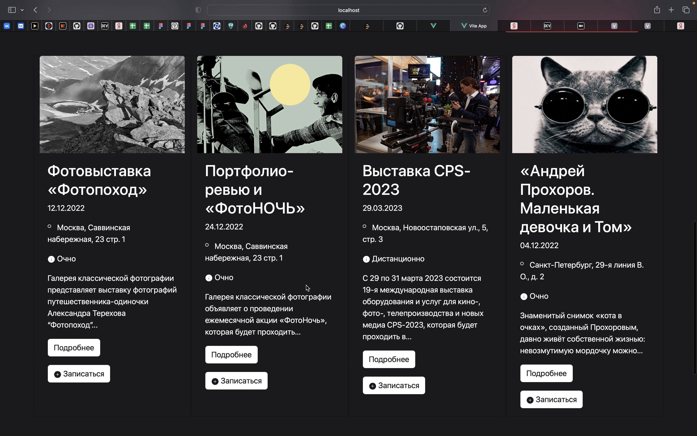

## Домашняя работа 5: изучение основ работы с менеджером зависимостей npm

Задание: изучить основные команды пакетного менеджера NPM и научиться стартовать проект на Vue.

* Глобальная установка vue и vue-cli

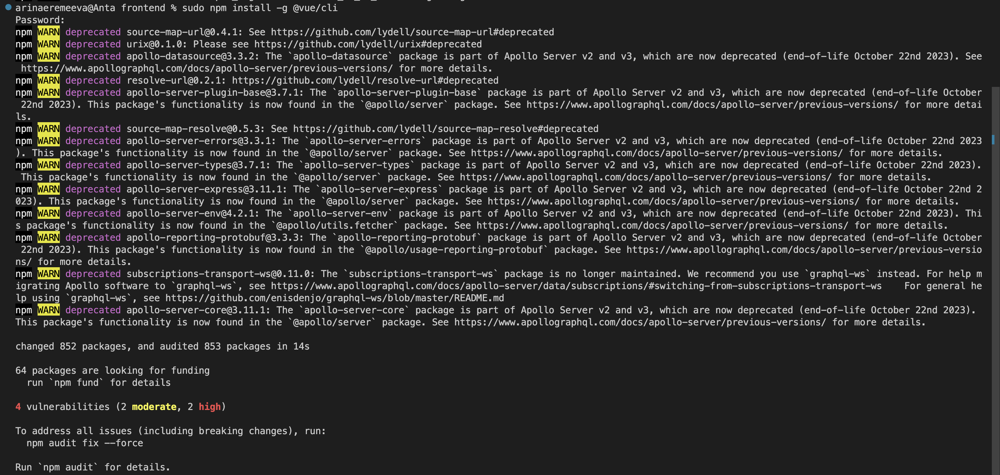

* Инициализация проекта и выбор параметров установки

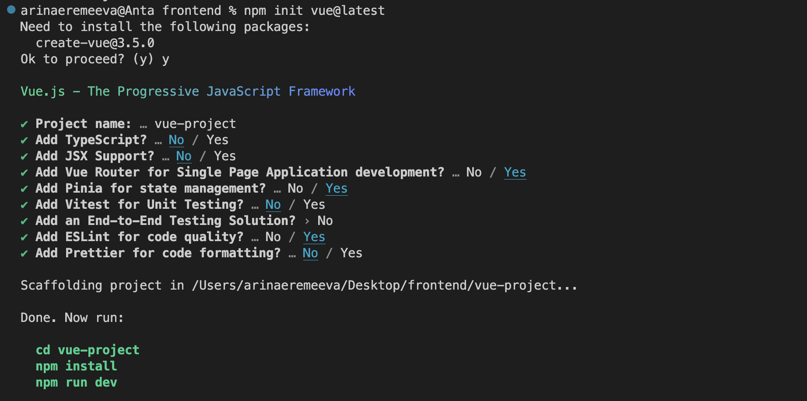

* Переходим в папку проекта

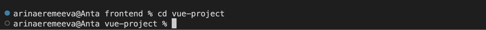

* Установка зависимостей

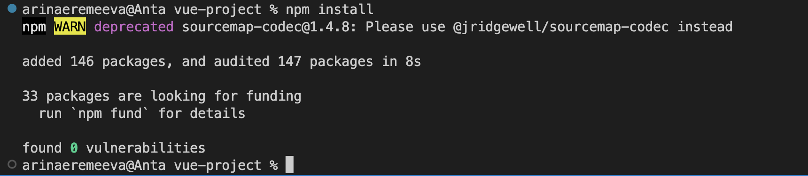

* `package.json`

* Изменения в файле package.json

```json
{
  "name": "vue-project",
  "version": "0.0.0",
  "private": true,
  "scripts": {
    "start": "vite --port 8080",
    "server": "json-server db.json -m ./node_modules/json-server-auth",
    "dev": "vite",
    "build": "vite build",
    "preview": "vite preview",
    "lint": "eslint . --ext .vue,.js,.jsx,.cjs,.mjs --fix --ignore-path .gitignore"
  },
  "dependencies": {
    "@fullcalendar/core": "^6.0.2",
    "@fullcalendar/daygrid": "^6.0.2",
    "@fullcalendar/interaction": "^6.0.2",
    "@fullcalendar/vue3": "^6.0.2",
    "axios": "^1.2.1",
    "bootstrap": "^5.2.3",
    "pinia": "^2.0.28",
    "pinia-persists": "^1.2.0",
    "vue": "^3.2.45",
    "vue-router": "^4.1.6"
  },
  "devDependencies": {
    "@typescript-eslint/eslint-plugin": "^5.48.2",
    "@typescript-eslint/parser": "^5.48.2",
    "@vitejs/plugin-vue": "^4.0.0",
    "@vue/compiler-sfc": "^3.2.45",
    "eslint": "^8.32.0",
    "eslint-plugin-vue": "^9.3.0",
    "json-server": "^0.17.1",
    "json-server-auth": "^2.1.0",
    "typescript": "^4.9.4",
    "vite": "^4.0.0"
  }
}
```

* Запуск проекта

